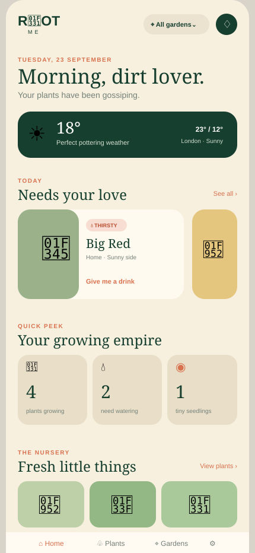

# ROOT ME 🌱

**Get dirty. Grow stuff.**

ROOT ME is a mobile-first, installable plant tracker with multiple gardens, growing spots, care reminders, life-stage tracking, and an intentionally cheeky personality.

## Interface preview



The preview captures the populated mobile dashboard at a 430 × 932 viewport, including attention cards, care totals, and the seedling nursery.

## Included in this first version

- Home dashboard with garden filtering, weather, attention cards, watering counts, seedlings, and recent activity
- Plant collection with search, care status, and detailed plant profiles
- Multiple gardens and locations
- Add-plant flow with garden, location, variety, and life stage
- Interactive watering action and populated sample data
- Responsive, iPhone-inspired interface
- PWA manifest and auto-updating service worker for installation and offline app-shell caching

## Run locally

Requires Node.js 20.19+ or 22.12+.

```bash
npm install
npm run dev
```

Open the local URL printed by Vite (normally `http://localhost:5173`).

## Quality checks

```bash
npm run lint
npm test
npm run build
```

## Current scope

This is a polished front-end prototype. Sample data lives in `src/data.ts`; actions reset when the page reloads. The next milestone should add persistent storage and authentication, followed by real photo upload, scheduled notifications, weather integration, and accessible garden/plant editing.
